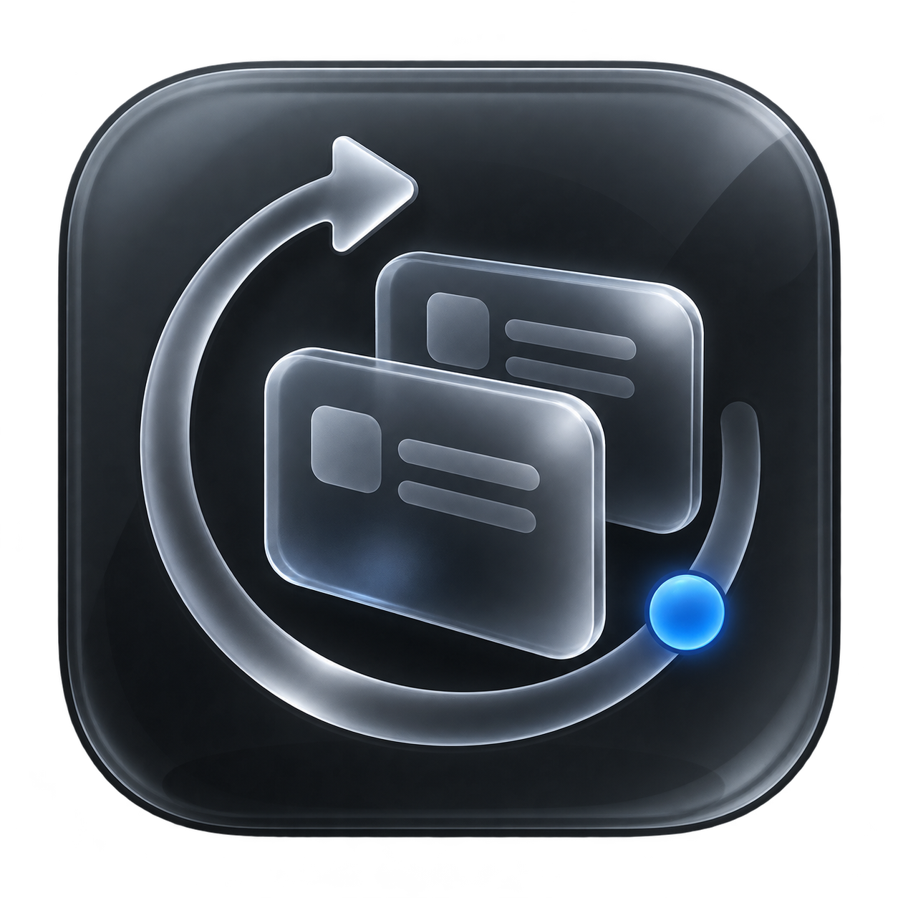
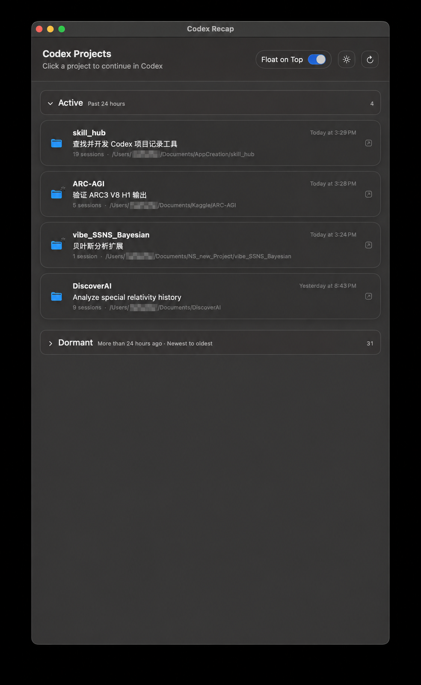

# Codex Recap

Codex Recap is a small, local-first macOS companion for finding Codex projects you recently worked on and reopening the right task before it gets forgotten.

<p align="center">
  
</p>

<p align="center">
  
  
  
  
</p>



## Why Codex Recap?

Codex work is often spread across many folders and tasks. The next day, remembering which project was active—and which result still needs attention—can be harder than reopening it. Codex Recap turns the local Codex history into a compact project dashboard:

- **Active** shows projects used during the past 24 hours.
- **Dormant** keeps older projects available, ordered from newest to oldest.
- Clicking a project opens its latest task directly in Codex Desktop.

## Features

- Groups local Codex tasks by working directory instead of showing a flat task list.
- Opens the latest task for a project through the native `codex://` URL handler.
- Uses Codex-compatible status semantics:
  - a spinner means at least one task in the project is running;
  - a blue dot means Codex has a completed, unread task;
  - no badge means completed tasks have already been opened.
- Refreshes task status automatically every three seconds.
- Provides collapsible **Active** and **Dormant** sections.
- Supports light and dark themes with a native Liquid Glass-style SwiftUI interface.
- Includes a persistent **Float on Top** switch.
- Runs locally with no analytics, telemetry, or separate account login.

## Requirements

- macOS 13 or later.
- Apple Silicon (`arm64`). An Intel build is not provided.
- Codex Desktop installed and signed in.
- At least one local Codex task on the Mac.

Codex Recap does **not** ask for your Codex credentials and does not have its own login screen. It uses the local data already created by Codex Desktop.

## Install

1. Open the repository's [Releases](../../releases) page.
2. Download `Codex-Recap-macOS-arm64.zip` and `SHA256SUMS.txt`.
3. Verify the download if desired:

   ```bash
   shasum -a 256 -c SHA256SUMS.txt
   ```

4. Unzip the archive and move **Codex Recap.app** to `/Applications`.
5. Open the app. If macOS blocks the unsigned build, right-click it and choose **Open** after confirming the checksum matches.

> Release builds are currently unsigned and not notarized. Never bypass a macOS warning if the downloaded checksum does not match the published checksum.

## How it works

Codex Recap reads the following local Codex files in read-only mode:

- `$CODEX_HOME/state_5.sqlite` for task identifiers, working directories, titles, and activity timestamps;
- `$CODEX_HOME/.codex-global-state.json` for Codex Desktop's completed-unread state;
- local rollout logs to determine whether the latest turn is still running.

When `CODEX_HOME` is not set, the app uses `~/.codex`. Selecting a project opens `codex://threads/<thread-id>`, handing navigation back to Codex Desktop.

No Codex data is uploaded by the app. See [PRIVACY.md](PRIVACY.md) for the complete privacy notes.

## Build from source

The macOS app has no third-party dependencies. Install Xcode Command Line Tools, then run:

```bash
git clone https://github.com/zcluster/Codex-Recap.git
cd Codex-Recap
./build_app.sh
open "dist/Codex Recap.app"
```

Create the distributable ZIP and SHA-256 checksum:

```bash
./package_release.sh
```

Run the tests:

```bash
python3 -m unittest -v
```

## Optional command-line tool

The repository also contains a zero-dependency Python CLI for listing recent Codex projects:

```bash
python3 codex_recent.py
python3 codex_recent.py --hours 48
python3 codex_recent.py --json
```

Use `python3 codex_recent.py --help` for all options.

## Project structure

```text
macos/CodexRecentApp.swift    SwiftUI application
macos/Info.plist              macOS bundle configuration
assets/                       App icon and README screenshot
codex_recent.py               Optional Python CLI
build_app.sh                  Local arm64 app build
package_release.sh            ZIP and checksum packaging
.github/workflows/release.yml Automated release workflow
```

## Compatibility

Codex Recap relies on Codex Desktop's local database schema, state file, rollout format, and URL handler. These are not guaranteed stable third-party APIs, so future Codex Desktop versions may require compatibility updates.

## Contributing

Issues and focused pull requests are welcome. When reporting a compatibility problem, include your macOS version and Codex Desktop version, but remove usernames, home-directory paths, task content, and other private information from screenshots or logs.

## Disclaimer

Codex Recap is an independent open-source project. It is not affiliated with, endorsed by, or sponsored by OpenAI. Codex and OpenAI are trademarks of their respective owners.

## License

Released under the [MIT License](LICENSE).
